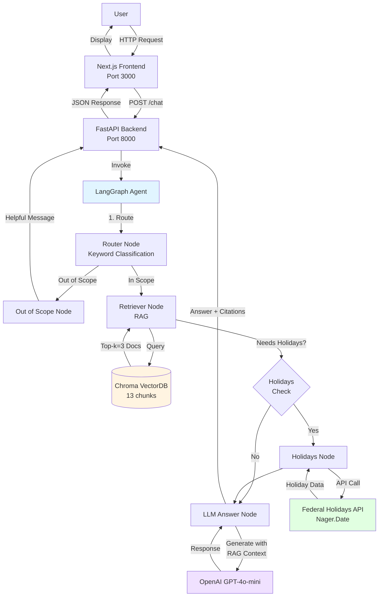
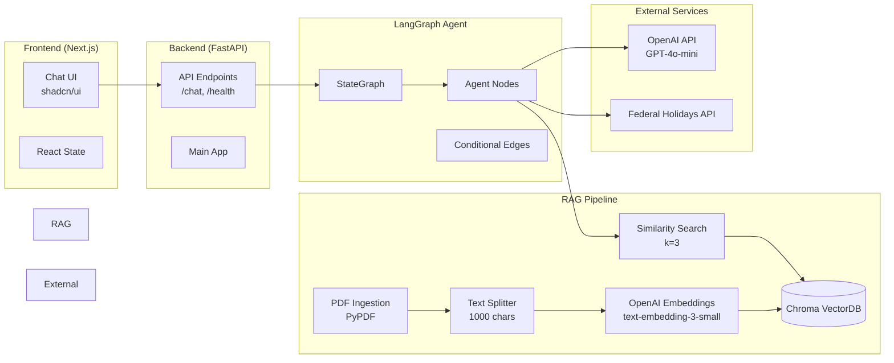
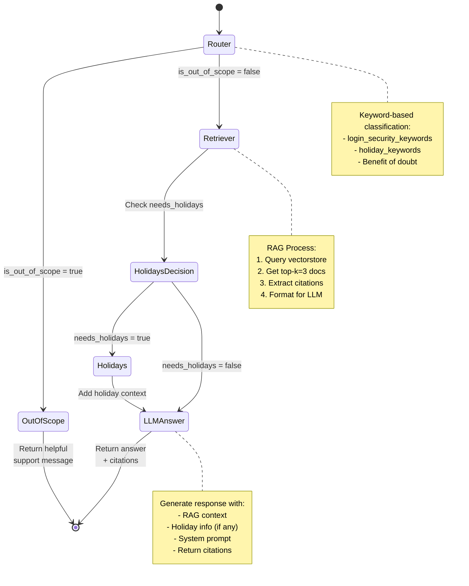
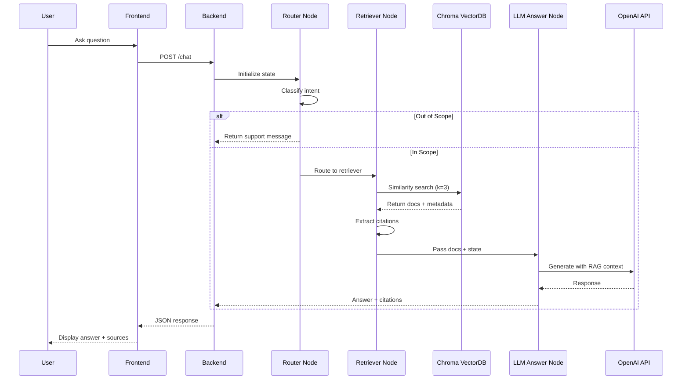

# Banking Login & Security Helper - Architecture

## System Overview

## Component Architecture

## Agent Flow (LangGraph)

## Data Flow

## Technology Stack

### Frontend
- **Framework**: Next.js 15 (React 19)
- **UI Library**: shadcn/ui + TailwindCSS
- **State**: React hooks
- **Deployment**: Docker (standalone output)

### Backend
- **API**: FastAPI (Python 3.11)
- **Agent**: LangGraph 0.2.60
- **Validation**: Pydantic

### AI/ML
- **LLM**: OpenAI GPT-4o-mini
- **Embeddings**: OpenAI text-embedding-3-small
- **Vector DB**: Chroma 0.5.23
- **Framework**: LangChain 0.3.14

### Data Processing
- **PDF Loader**: PyPDF 5.1.0
- **Text Splitter**: RecursiveCharacterTextSplitter
  - Chunk size: 1000 characters
  - Chunk overlap: 200 characters

### Infrastructure
- **Containerization**: Docker + Docker Compose
- **Persistence**: Volume mounts (`./backend/data`)

## Key Design Decisions

### 1. Keyword-based Router
- **Choice**: Keyword matching over LLM classification
- **Rationale**: Faster, more reliable, no extra LLM calls
- **Trade-off**: Less flexible, requires keyword maintenance

### 2. Chroma Vector Database
- **Choice**: Chroma over FAISS/Pinecone
- **Rationale**:
  - Persistent storage
  - Easy Docker integration
  - Metadata support
  - Good performance for small-medium datasets

### 3. Small Chunk Size (1000 chars)
- **Choice**: 1000 chars with 200 overlap
- **Rationale**:
  - Better semantic granularity
  - More precise citations
  - Fits within LLM context window efficiently

### 4. Top-k=3 Retrieval
- **Choice**: Retrieve 3 most relevant chunks
- **Rationale**:
  - Balance between context and noise
  - Keeps LLM prompt concise
  - Meets latency SLA

### 5. Benefit of Doubt Routing
- **Choice**: Assume in-scope if no keywords match
- **Rationale**:
  - Better UX (attempt to answer)
  - Scope is broad (login/security)
  - Can still defer to support if needed

## Performance Characteristics

- **p95 Latency**: ~5 seconds (meets SLA)
- **p50 Latency**: ~4-5 seconds
- **Vector DB Size**: 13 chunks (from 5 PDF pages)
- **Embedding Dimensions**: 1536 (text-embedding-3-small)
- **Memory Usage**: ~500MB (including vectorstore)
- **Container Size**: ~2GB (backend), ~500MB (frontend)

## Security Considerations

- **API Key Management**: Environment variables, .gitignore
- **Data Isolation**: No user data stored, stateless design
- **Scope Limitation**: Only answers login/security questions
- **Safe Fallback**: Directs to support for out-of-scope

## Observability

- **Logging**: Print statements to stdout (Docker logs)
- **Metrics**: Response timing in API response
- **Citations**: Source tracking per response
- **Tool Calls**: Logged in response metadata

## Future Enhancements

1. **Streaming**: SSE endpoint for progressive responses
2. **State Persistence**: Redis/SQLite for conversation history
3. **Structured Logging**: JSON logs with correlation IDs
4. **Rate Limiting**: Per-user request throttling
5. **A/B Testing**: Multiple retrieval strategies
6. **Fine-tuning**: Custom embeddings model
7. **Monitoring**: Prometheus/Grafana dashboards
